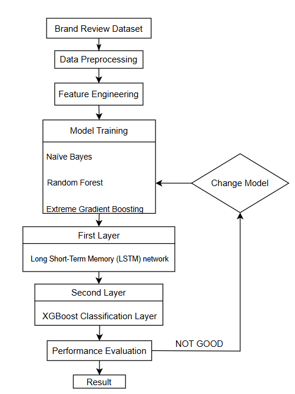
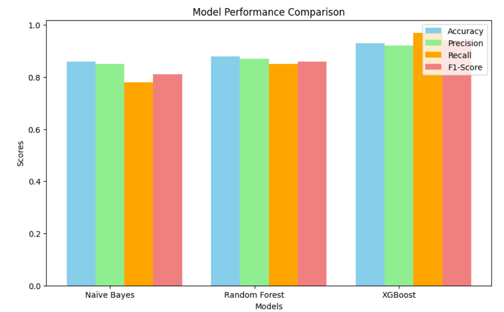

# Customer Review Analysis for Brand Insight

## Project Overview

This project analyzes over 10,000 customer reviews to evaluate brand perception and identify sentiment trends using Natural Language Processing (NLP) and Machine Learning techniques.

## Objectives

- Analyze customer sentiment
- Evaluate brand reputation
- Compare machine learning models
- Generate business insights from customer feedback

## Technologies Used

- Python
- NLP
- TF-IDF
- Naive Bayes
- Random Forest
- XGBoost
- LSTM

## Proposed Framework

## Model Performance Comparison

## ROC Curve Comparison

## Key Skills Demonstrated

- Data Cleaning
- Feature Engineering
- Sentiment Analysis
- Machine Learning
- Data Visualization
- Business Reporting

## Outcome

Successfully developed a sentiment analysis model capable of predicting customer sentiment and supporting brand evaluation through data-driven insights.
